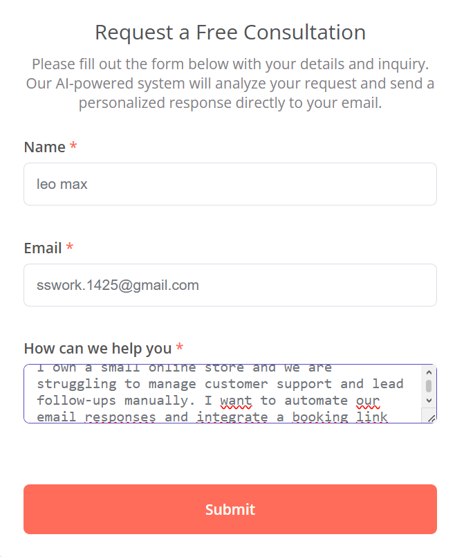
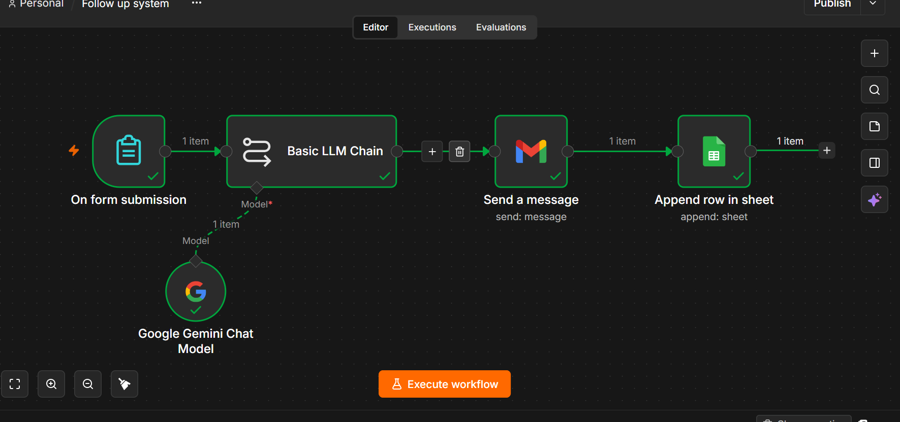
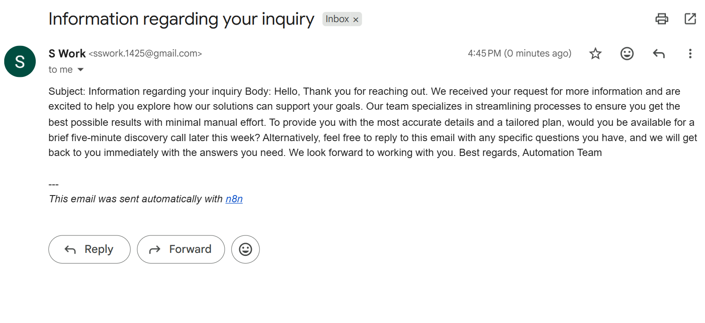
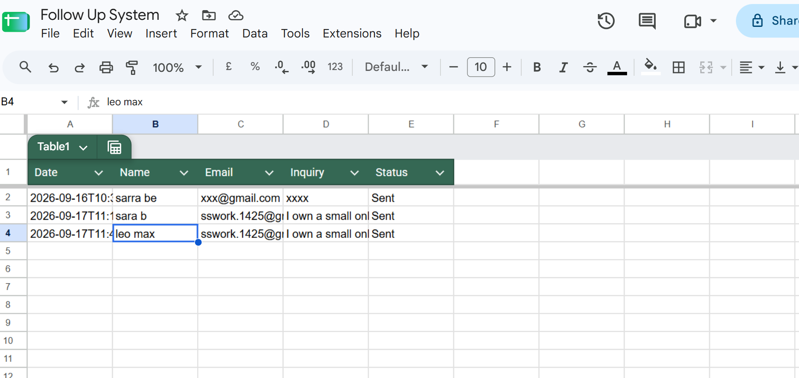

# 🚀 AI Lead Follow-Up System

An automated end-to-end lead nurturing and response system built with **n8n**, **Gemini AI**, **Gmail**, and **Google Sheets**. This workflow instantly captures incoming form leads, generates personalized AI follow-up emails based on user inquiries, dispatches emails via Gmail, and logs interactions in Google Sheets for real-time tracking.

---

## 📹 Video Demo

Watch the full system walk-through and execution test:
👉 **[Watch Demo Video on Loom](https://www.loom.com/share/677e0a7ede3c4fc3b08d1dd11deaf02b)**

---

## 🛠️ Tech Stack & Integration Architecture

* **n8n**: Workflow orchestration & triggers
* **Gemini AI (Google)**: Dynamic email generation & context analysis
* **Gmail API**: Instant automated email dispatch
* **Google Sheets API**: Activity logging & database storage

---

## ⚡ Workflow Architecture

1. **`n8n Form Trigger`**: Captures new lead submissions (`Name`, `Email`, `Inquiry`).
2. **`Gemini AI (Basic LLM Chain)`**: Evaluates lead input and crafts a personalized Arabic/English response.
3. **`Gmail Node`**: Extracts AI output dynamically and sends the email directly to the lead.
4. **`Google Sheets Node`**: Appends the submission timestamp, lead details, email body, and status (`Sent`) into the spreadsheet.

---

## 🖼️ System Screenshots

| Form Submission Interface |
| :---: |
|  |

| Complete n8n Workflow |
| :---: |
|  |

| AI Email Delivered to Inbox | Google Sheets Interaction Log |
| :---: | :---: |
|  |  |

---

## 💡 Business Value & Key Benefits

* **Zero Latency (Speed-to-Lead):** Eliminates response delays by reaching leads within seconds of submission.
* **Context-Aware Responses:** Provides tailored advice and direct call-to-action links instead of static email templates.
* **Full Audit Trail:** Centralizes all interactions inside Google Sheets for sales team visibility.

